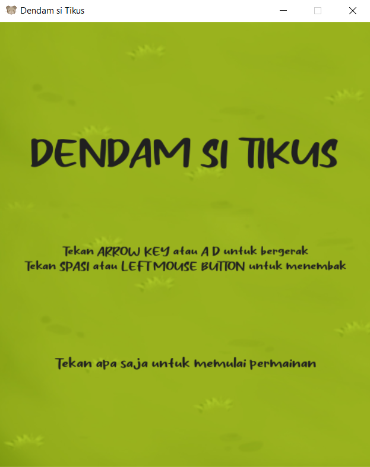
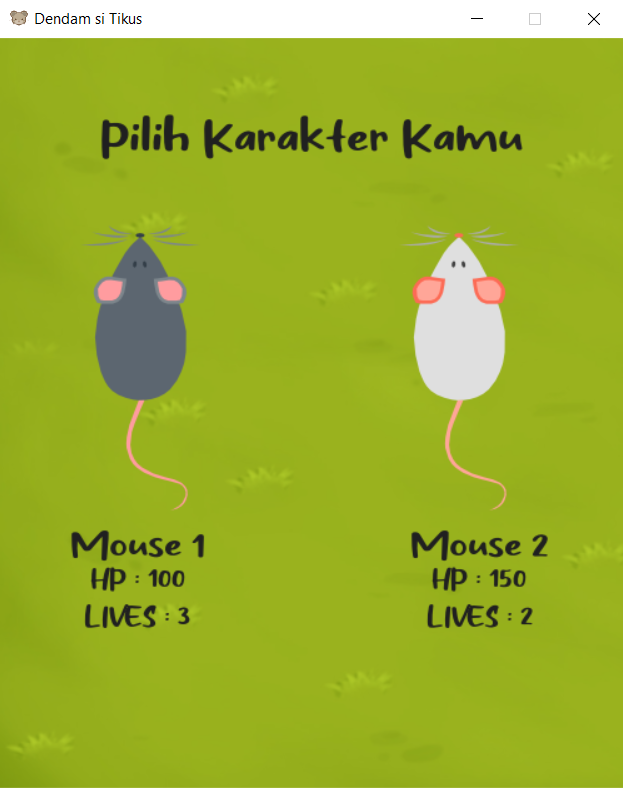

> Dendam si tikus. Proyek ini adalah proyek game menggunakan pygame.

## Screenshots

## Deskripsi Projek
Aplikasi ini merupakan permainan tentang seekor tikus yang berusaha mengalahkan kucing dengan cara menyerang para kucing menggunakan racun. 

Permainan ini bertujuan untuk mendapatkan score sebanyak-banyaknya dengan cara menghindari dan mengalahkan para kucing yang berdatangan. Nyawa Tikus akan berkurang saat kucing menyentuh tikus. Permainan ini akan berakhir jika nyawa tikus telah habis.

## Dependensi paket (library) yang dibutuhkan untuk menjalankan aplikasi
- from ast import Pow
- from asyncio import shield
- import pygame
- import random
- import os
- import json

## How to play
Cara memainkan game ini adalah dengan menggerakkan mouse menggunakan tombol panah atau A/D dan spasi atau klik kiri mouse untuk menembak. Tikus tidak boleh menyentuh kucing atau darah dan nyawa akan berkurang.

## UML Class Diagram
Diagram UML kami dapat dilihat pada link berikut. [klik disini](https://drive.google.com/file/d/1FcX4S-45jDknvLn2QgNUnih0ppBYcN5X/view?usp=sharing)

## Kontributor pengembangan aplikasi
RC-03
- 120140021 Mila Oktaviani
- 120140088 Bayu Nindioko
- 120140107 Naufal Rotif Dewanto
- 120140111 Azka Muzhaffar Sutawidjaja
- 120140119 Ericho Aldo Firano
- 120140191 Andri Setiawan
